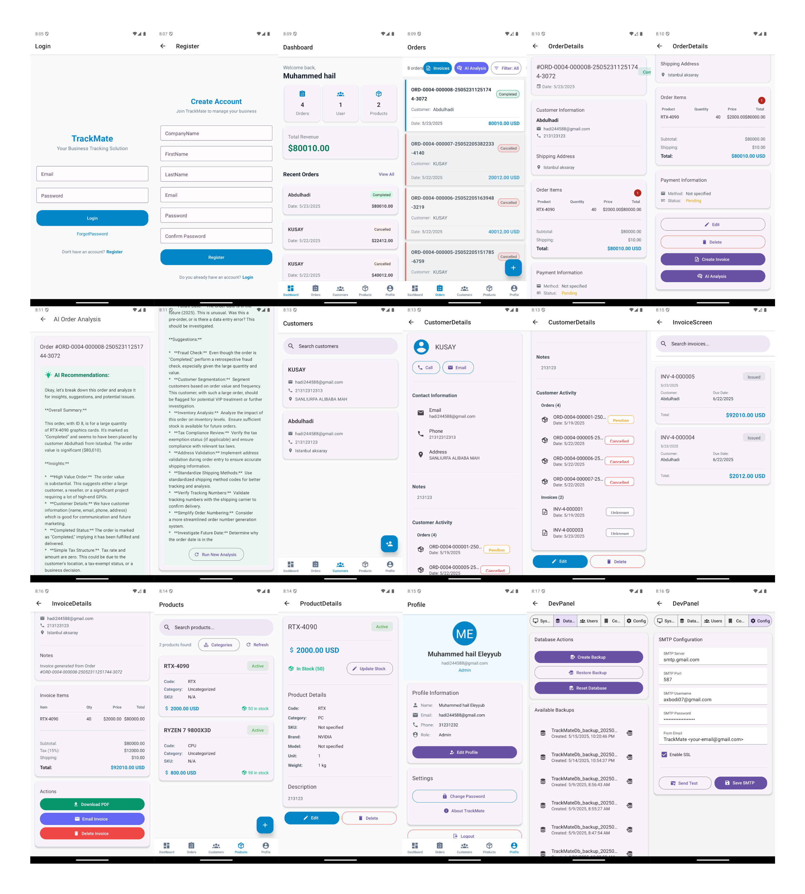
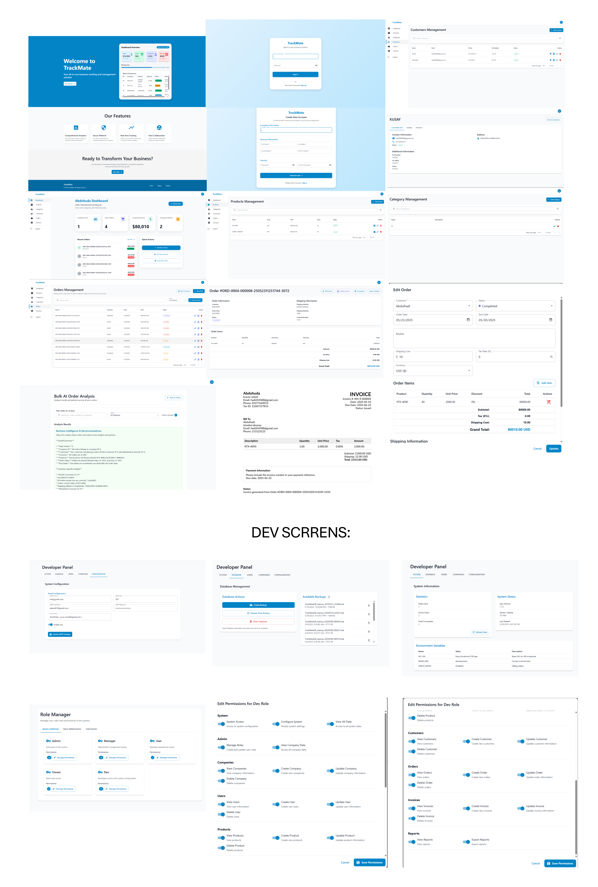

# 🏢 TrackMate Otomasyonu
## 🚀 Proje Amacı
- İş süreçlerini dijitalleştirerek verimliliği artırmak.
- Birden fazla şirketin tek sistem üzerinden yönetimini sağlamak.
- Güvenli ve yetkilendirilmiş bir kullanıcı yönetim sistemi oluşturmak.
- Fatura ve belge işlemlerini kolaylaştırmak.
- Merkezi admin paneli ile sistem yönetimini basitleştirmek.

## 🎯 Hedef Kitle
TrackMate, küçük, orta ve büyük ölçekli işletmeler için geliştirilmiş bir iş otomasyon sistemidir. Özellikle:

- Birden fazla şirketi aynı sistem altında yönetmek isteyen holdingler,
- Fatura, raporlama ve belge yönetimi süreçlerini dijitalleştirmek isteyen muhasebe departmanları,
- Mobil ve web üzerinden operasyonel süreçlerini takip etmek isteyen işletmeler,
- Yapay zeka destekli analizlerle karar süreçlerini optimize etmeyi hedefleyen yöneticiler ve danışmanlar için idealdir.

## 🛠️ Kullanılan Teknolojiler
- Web Frontend: React
- Mobil Frontend: React Native + Expo
- Backend: ASP.NET
- Veritabanı: MS SQL
- Doküman İşleme: Excel & PDF formatlarında çıktı oluşturma
- İletişim Araçları: E-posta bildirim sistemi
- Güvenlik: JWT tabanlı kimlik doğrulama, rol ve şirket bazlı erişim kontrolü
- Yapay Zeka: Google Gemini API entegrasyonu
- Çoklu Dil Desteği: Türkçe ve İngilizce yerelleştirme

## 🌟 Özellikler
🇸 Çok Şirketli Mimari - Her şirketin verileri izole edilmiştir.
🌐 Güçlü Admin Paneli - Tüm sistem bileşenleri merkezi olarak yönetilebilir.
🛠️ Otomatik Bildirimler - Müşteri bildirimleri için e-posta entegrasyonu.
🏆 Esnek Raporlama - Özelleştirilebilir rapor şablonları (PDF).
🔒 Yetkilendirme Sistemi - Şirket, rol ve kullanıcı bazlı erişim kontrolleri.
🤖 Yapay Zeka Entegrasyonu - Google Gemini API ile akıllı analiz.
🌍 Çoklu Dil Desteği - Türkçe ve İngilizce arayüz desteği.

## 🌍 Dil Desteği
TrackMate, kullanıcıların tercih ettikleri dilde deneyim yaşayabilmeleri için çoklu dil desteği sunar:

- **🇹🇷 Türkçe**: Tam yerelleştirme desteği
- **🇺🇸 İngilizce**: Varsayılan dil desteği
- **Özellikler**:
  - Tüm UI bileşenleri çevrilmiş
  - Dinamik dil değiştirme
  - Desteklenmeyen diller için otomatik geri dönüş
  - Türkçe kullanıcılar için optimize edilmiş arayüz

## 📱 Mobil Uygulama Görünümü

TrackMate mobil uygulaması, modern ve kullanıcı dostu arayüzüyle işletmelerin ceplerinde!



## 💻 Web Arayüzü

TrackMate web paneli, şirketlerin yönetimini sade ve güçlü bir arayüzle sunar.



## 🔗 Canlı Proje

[🟢 TrackMate Web Uygulaması](https://track-mate-hazel.vercel.app) – Şirketlerinizi yönetin, fatura oluşturun, raporları görüntüleyin ve daha fazlasını keşfedin.

---

## 🧠 Yapay Zeka Entegrasyonu
TrackMate, Google Gemini API kullanılarak gelişmiş yapay zeka özellikleri sağlamaktadır.

### 🤖 Google Gemini API Entegrasyonu
Backend projemize entegre ettiğimiz Google Gemini API, şu temel özellikleri sunmaktadır:

- **Sipariş Analizi (`/api/ai/analyze-order`)**: 
  - Tek bir siparişi analiz eder
  - Anomalileri tespit eder
  - İyileştirme önerileri sunar

- **Toplu Sipariş Analizi (`/api/ai/analyze-orders`)**:
  - Çoklu siparişleri analiz eder
  - Desenler ve eğilimler tespit eder
  - Toplu görünümde öneriler sunar

### 💻 Teknik Uygulama
- **AIController**: Frontend'e RESTful API endpoints sağlar
- **GoogleAIService**: Google Gemini API ile iletişim kurar
- **Hata Yönetimi**: Yedek mekanizmalar ve zaman aşımı kontrolleri
- **Güvenlik**: JWT ile korunan API endpoints

### ⚙️ Yapılandırma
Google Gemini API entegrasyonu şu ayarlarla yapılandırılmıştır:
- Model: gemini-2.0-flash
- Zaman Aşımı: Yapılandırılabilir (varsayılan: 60 saniye)

## 📁 Proje Klasör Yapısı
```
TrackMate/
│── backend/              # ASP.NET Backend API  
│── frontend-web/         # React Web Uygulaması  
│── frontend-mobile/      # React Native Mobil Uygulaması  
│── docs/                 # Proje dökümantasyonları  
│── README.md             # Proje açıklamaları
```

## 🔧 Kurulum & Çalıştırma

### 1️⃣ Backend Kurulumu (ASP.NET)
```
cd backend
dotnet restore
dotnet run
```
Backend API http://localhost:5105 adresinde çalışacaktır.

### 2️⃣ Web Frontend (React)
```
cd frontend-web
npm install
npm start
```
Web uygulaması http://localhost:5173 adresinde çalışacaktır.

### 3️⃣ Mobil Frontend (React Native + Expo)

#### Proxy Sunucusu Kurulumu
Mobil uygulama, backend API'ye bağlanmak için bir proxy sunucusu kullanır. Bu, CORS sorunlarını önler ve fiziksel cihazlarla test yaparken bağlantı sorunlarını çözer.

```
cd frontend-mobile
npm install
```

API isteklerini http://localhost:5105 adresine yönlendirebilmesi için Mobilde Src context.js içinde ip değişmesi gerekiyor.

#### Expo ile Çalıştırma
Yeni bir terminal penceresinde (proxy sunucusu çalışırken):

```
cd frontend-mobile
npx expo start
```

Bu komut bir QR kodu gösterecektir. Bu kodu mobil cihazınızdaki Expo Go uygulaması ile tarayarak uygulamayı test edebilirsiniz.

#### Hata Giderme
Eğer "java.io.ioexception remote update request not successful" hatası alırsanız:

1. Tüm Expo ve Metro bundler süreçlerini kapatın
2. frontend-mobile klasöründeki reset-expo.bat dosyasını çalıştırın:
   ```
   cd frontend-mobile
   reset-expo.bat
   ```
3. Proxy sunucusunu ve Expo'yu yeniden başlatın

## 🤝 Katkıda Bulunanlar

Projemize değerli katkılarından dolayı teşekkür ederiz:

### 🌍 Çoklu Dil Desteği
- **[@ela-seyitali](https://github.com/ela-seyitali)** - Türkçe yerelleştirme ve çoklu dil desteği implementasyonu
  - Türkçe çeviri dosyalarının oluşturulması
  - Bileşen ve sayfaların yerelleştirme desteği
  - Desteklenmeyen diller için geri dönüş mekanizması
  - Türkçe kullanıcı arayüzü testleri

## 📅 İş Takvimi
- [x] Backend API Geliştirme
- [x] Web Arayüzü Geliştirme
- [x] Mobil Uygulama Geliştirme
- [x] Google Gemini Yapay Zeka Entegrasyonu
- [x] Türkçe Dil Desteği Ekleme
- [ ] Diğer dil desteği genişletmesi

## 📧 İletişim
Her türlü soru ve iş birliği için:  
📩 [abdulhadialayoub@gmail.com](mailto:abdulhadialayoub@gmail.com)
📌 **Geliştirici:** Abdulhadi ELEYYÜB  
📌 **Danışmanlar:** Öğr.Gör. Eyüp ERÖZ, Dr. Öğr. Üyesi Vahdettin Cem BAYDOĞAN
